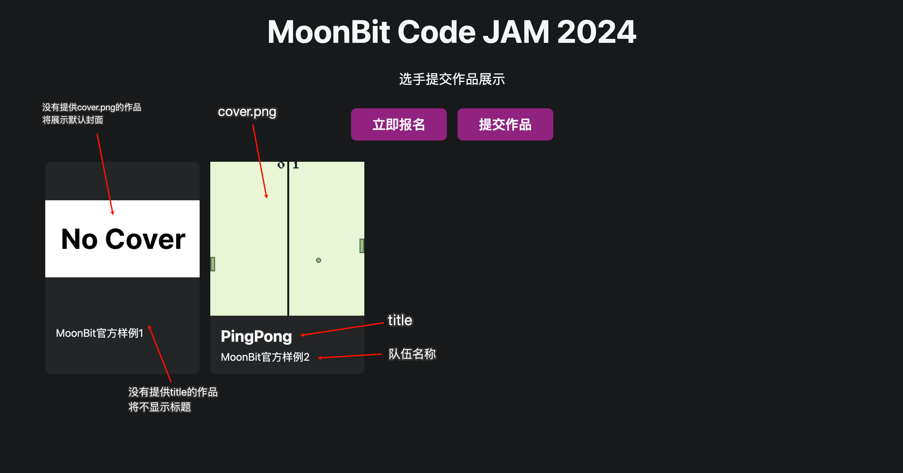
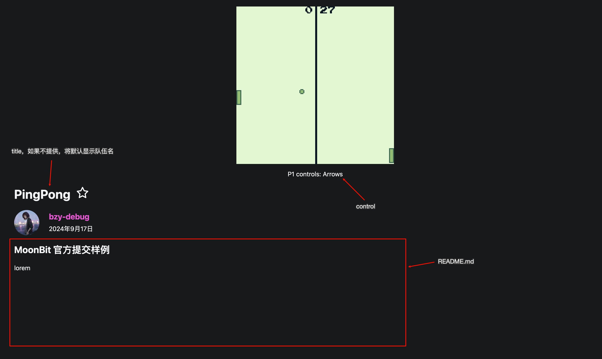

# 2024 年 MoonBit 全球编程创新挑战赛游戏赛道提交仓库

赛事详情与报名方式见：<https://tianchi.aliyun.com/s/42503d88fe6e219f3260251114461b54>

## 提交流程

1. 创建本仓库的 fork
1. 在 teams 文件夹下以自己的队伍名创建文件夹
1. 文件夹中至少包含以下文件：
   - `game.wasm`: 编译后的游戏本体
   - `README.md`: 游戏描述及说明
1. 提交 PR

## 提交文件及作用

除了上面提到的 `game.wasm` 和 `README.md` 以外，选手提交的文件夹还可以包含以下文件：

- `control`：utf-8 编码的文本文件，说明游戏的控制方法
- `title`：utf-8 编码的文本文件，游戏的标题
- `cover.png`：游戏封面图片，会在展示页面渲染

这些文件可以控制提交的游戏在展示页和详情页的渲染，具体作用如下图所示

## 如果你有任何问题，请在 issue 中提问
