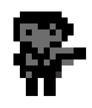
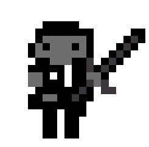
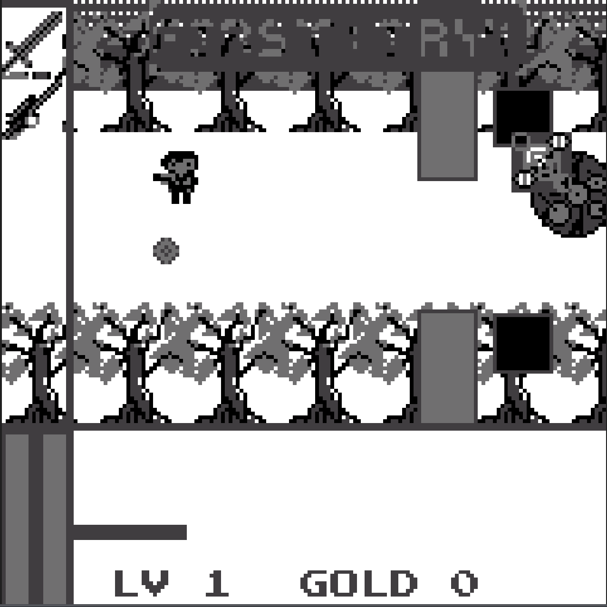
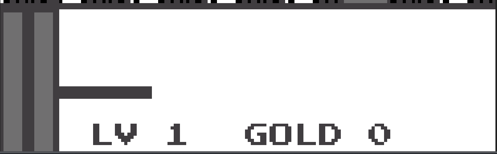
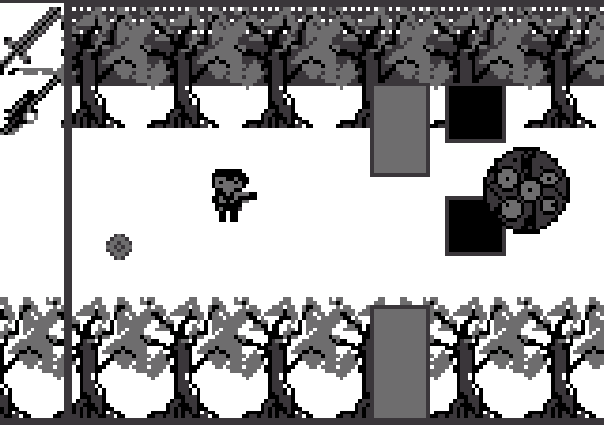
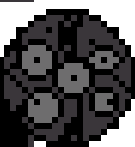
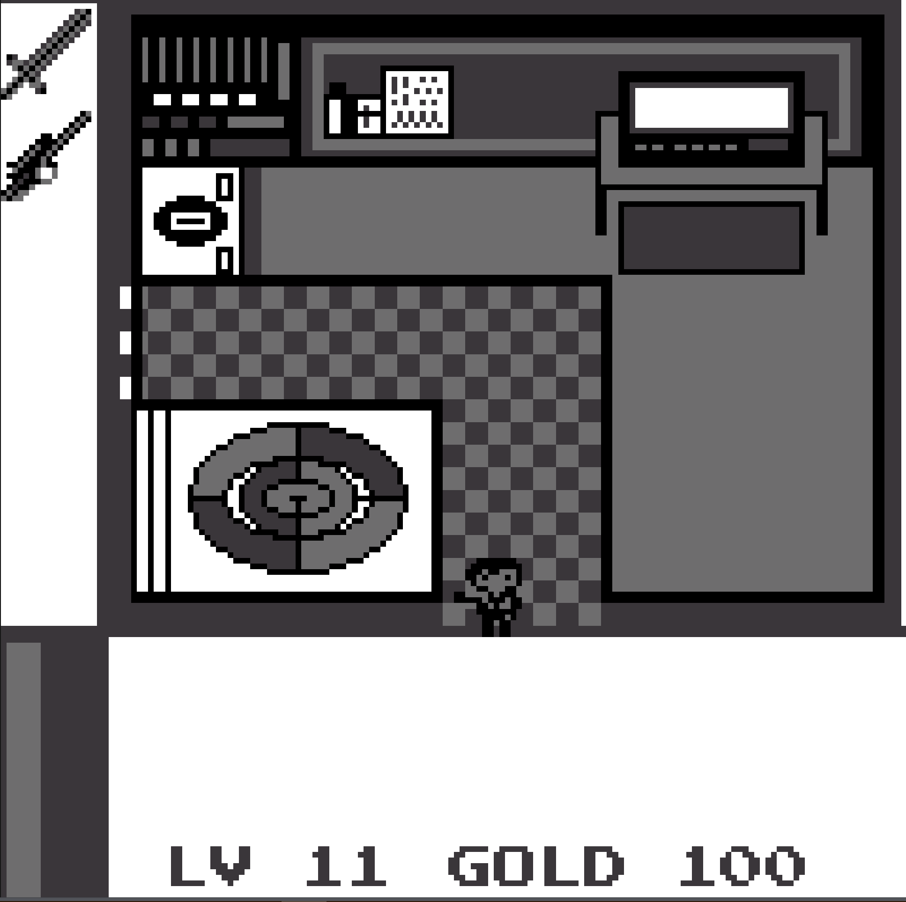
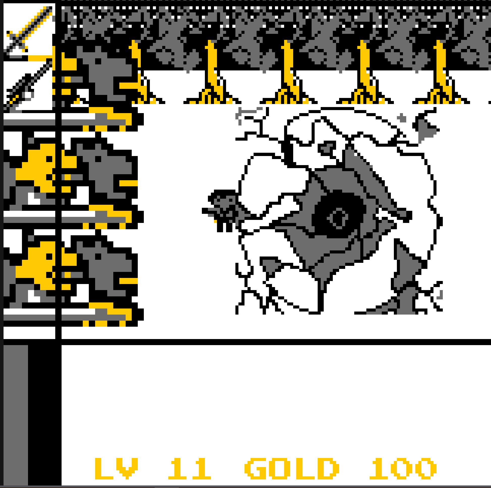
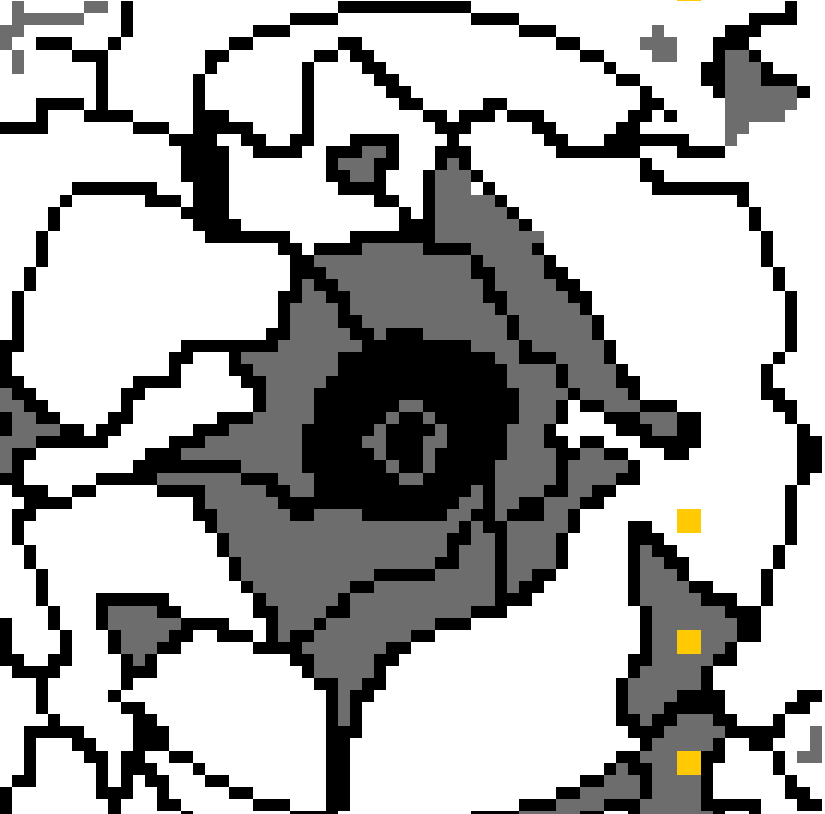

#ColorNoise：色噪v2.0

###更新：优化逻辑，增加san值栏
san值为0时缓慢扣血

这是一次奇异的经历，你可以认为是一场梦、或是一次奇遇。
你来到了一个光怪陆离的世界，它失去色彩并且充满噪音，你感受到自己日渐疯狂、难以忍受，但还好，你还有手中的武器。
去消灭那个疯狂的星球状怪物：科洛诺斯
将世界复原，找寻回家的路吧。

##封面：
<!DOCTYPE html>
<html lang="en">
<head>
<meta charset="UTF-8">
<meta name="viewport" content="width=device-width, initial-scale=1.0">
<title>Image Container</title>

</head>
<body>

  

</body>
</html>

##角色控制
方向键：上下左右控制角色移动
z键：攻击/购买
x键：切换角色/退出场景/进入场景

###主角——枪

###主角——剑

*双主角可长按x切换（商店中有可填补主角———剑空虚的心的道具，获得后atk增加10点） 

##游戏场景1

<!DOCTYPE html>
<html lang="en">
<head>
<meta charset="UTF-8">
<meta name="viewport" content="width=device-width, initial-scale=1.0">
<title>Image Container</title>

</head>
<body>

  

</body>
</html>

*画面下方为状态框与文本显示及操作提示框（可按照提示操作）

<!DOCTYPE html>
<html lang="en">
<head>
<meta charset="UTF-8">
<meta name="viewport" content="width=device-width, initial-scale=1.0">
<title>Image Container</title>

</head>
<body>

  

</body>
</html>

*此处为画面场景，最左侧为可选角色框

#该方块为陷阱，踩到将会扣血

#此处为法阵，触发后将会进入魔法师房间

##游戏场景2 魔法师房间
*魔法师房间可以缓慢恢复理智
<!DOCTYPE html>
<html lang="en">
<head>
<meta charset="UTF-8">
<meta name="viewport" content="width=device-width, initial-scale=1.0">
<title>Image Container</title>

</head>
<body>

  

</body>
</html>

前往右上角电视处可以购物

###购物界面：
*长按方向键右键选择，右键加Z键购买

<!DOCTYPE html>
<html lang="en">
<head>
<meta charset="UTF-8">
<meta name="viewport" content="width=device-width, initial-scale=1.0">
<title>Image Container</title>

</head>
<body>

  

</body>
</html>

##游戏场景3 

<!DOCTYPE html>
<html lang="en">
<head>
<meta charset="UTF-8">
<meta name="viewport" content="width=device-width, initial-scale=1.0">
<title>Image Container</title>

</head>
<body>

  

</body>
</html>

需击杀左边三个怪物方可离开

<!DOCTYPE html>
<html lang="en">
<head>
<meta charset="UTF-8">
<meta name="viewport" content="width=device-width, initial-scale=1.0">
<title>Image Container</title>

</head>
<body>

  

</body>
</html>
大空洞，进去探索吧

##游戏场景4

长按x进入洞穴，穿过岩洞，你将见到最后的boss
击杀boss，获得胜利，回归真实吧。