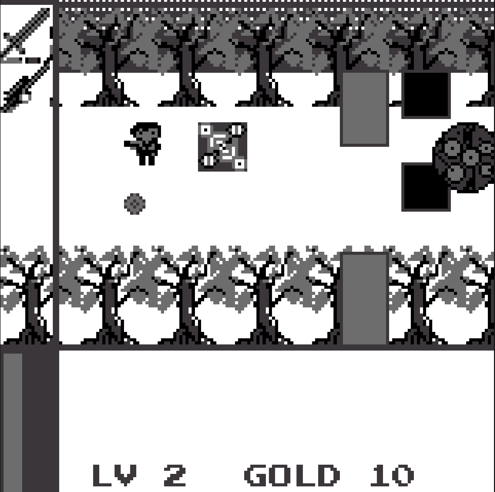
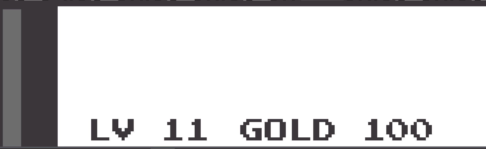

ColorNoise：色噪
这是一次奇异的经历，你可以认为是一场梦、或是一次奇遇。
你来到了一个光怪陆离的世界，它失去色彩并且充满噪音，你感受到自己日渐疯狂、难以忍受，但还好，你还有手中的武器。
去消灭那个疯狂的星球状怪物：科洛诺斯
将世界复原，找寻回家的路吧。

封面：

方向键：上下左右控制角色移动
z键：攻击/购买
x键：切换角色/退出场景/进入场景

主角——枪

主角——剑

双主角可长按x切换（商店中有可填补主角———剑空虚的心的道具，获得后atk增加10点） 

游戏场景1

画面下方为状态框与文本显示及操作提示框（可按照提示操作）

此处为画面场景，最左侧为角色属性框

该方块为陷阱，踩到将会扣血

此处为法阵，触发后将会进入魔法师房间

游戏场景2 魔法师房间

前往右上角电视处可以购物
购物界面：长按方向键右键选择，右键加Z键购买

游戏场景3 

需击杀左边三个怪物方可离开

大空洞，进去探索吧

游戏场景4
长按x进入洞穴，穿过岩洞哦那个，你将见到最后的boss