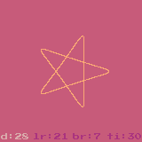
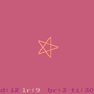
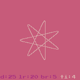
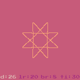
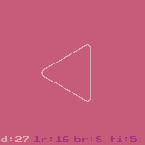
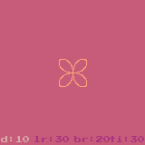
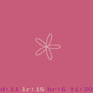
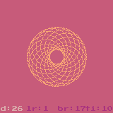
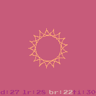

## 内旋轮线模拟器（Hypotrochoid Emulator）

## 介绍
内旋轮线模拟器，一款关于`探索`与`发现`的`图形艺术`游戏，通过调整参数，探索参数与图形特点的相关性。

## 玩法

- 按`空格键`开始
- `X`键 切换轮线颜色
- `Z`键 显示/隐藏参数菜单
- `左/右`键选择参数
- `上/下`键调调整参数数值
- `F9` 截取图像

## 参数说明

- d: 小圆上固定点到小圆圆心的距离
- lr: 小圆的半径
- br: 大圆的半径
- ti: 旋转次数

## 典型参数
- 五角星

- 五角星-小

- 七角星

- 八角星

- 三角形

- 四叶草

- 五叶花-小

- 五叶花

- 六叶草

- 七叶草

- 雏菊-小

- 雏菊

- 甜甜圈

- 太阳


-
## 编译及运行

```bash
# install moonbit
curl -fsSL https://cli.moonbitlang.cn/install/unix.sh | bash
# install wasm4
npm install -D wasm4
# 
moon update && moon add moonbitlang/wasm4
# build
moon build --target wasm 
# run
npx wasm4 run target/wasm/release/build/hypotrochoid_emulator.wasm

```

## 参考
灵感来源于阿里天池[画月饼过云上中秋](https://tianchi.aliyun.com/competition/entrance/531836/introduction) 活动, [Spaceack](https://spaceack.com/20201001-python利用matplotlib万花尺画月饼/)的最佳创意获奖作品： [Python利用matplotlib万花尺画月饼](https://blog.csdn.net/a541972321/article/details/110009298)