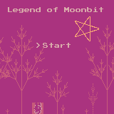
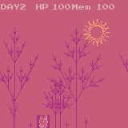
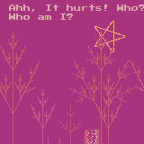
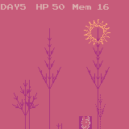
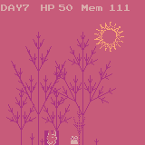

# 月兔传说（(The Legend Of Moonbit)）

## ----故事-----
### 背景
在广袤的宇宙中，有一颗闪亮的卫星——月球，这里生活着一群拥有特殊能力的生物，它们被称为“月兔”（Moonbit）。月兔们能够操控一种神秘的能量，这种能量让他们能够创造和修复虚空世界中的各种程序。在这个世界里，有一只名叫阿洛（Alo）的小月兔，它从小就被月球上的古老机器所吸引，梦想着成为一名伟大的程序员，能够创造出令人惊叹的程序。

### 第一章：BUG来袭
 某天，一颗携带着未知程序病毒的流星撞击了月球村，不仅破坏了月球上的许多设施，产生的程序BUG还导致阿洛（Alo）失去了大部分的记忆，包括它对编程的热情和梦想。阿洛发现自己虽然失去了记忆，但依然对那些古老的机器有着不可名状的亲切感。

### 第二章：寻回记忆
为了找回自己的过去，阿洛（Alo）决定踏上旅程，去探索月球上那些未被发现的角落，寻找能够恢复记忆的线索。在这段旅途中，阿洛（Alo）遇到了来自不同星球的朋友，它们教会了阿洛一个技能，使其如何对抗那些威胁月球安全的BUG，同时也让阿洛重新认识到了编程的乐趣。

随着时间的推移，阿洛（Alo）通过解决掉一个又一个的BUG，不仅保护了月球的安全，也逐渐找回了自己的记忆碎片。每找回一片记忆，阿洛对编程的理解就更深刻一分，它开始意识到，编程不仅仅是技术的堆砌，更是创造力和梦想的表达。

### 第三章：梦想实现
在经历了漫长的旅途后，通过阿洛（Alo）的努力终于击败了最终的程序病毒BOSS，月球上的程序BUG得到了彻底的解决，月球也恢复了往日的繁荣与和平。它决定将自己对编程的理解和经验分享给更多的人，让更多的人能够通过编程来创造出令人惊叹的程序。

### 最终章：兔月传说
阿洛（Alo）不仅为月球带来了新的希望，也让阿洛成为了所有月兔心中的英雄。阿洛的故事激励了每一个月兔，让它们明白了珍惜现在、要敢追求梦想和善于思考并勇实践的重要性。于是，为了纪念阿洛（Alo），小月兔们决定创建一个虚空世界，名为《月兔传说》...

## 玩法

- `X`键 显示/隐藏参数菜单
- `Z`键 长按跳过剧情对话
- `左/右`移动
- `上`跳跃
- `F9` 截取图像

## 参数说明

- mem: 记忆碎片值

## 剧情

 - 开始
    

- 带有BUG的流星来袭

    
    
    
    
- 失忆
    
    
    

## 游戏背后的故事

- 在我的第一个游戏“井子棋”完成后，我便投入到第二个游戏的构思中。虽然“井子棋”较为快速的完成，但与赛题“创新挑战”大相径庭。 与此同时，已有许多令人惊艳的，印象深刻的作品，如：
- 自由探索风格的《沙漠之魂》，精妙设计的《Tank Adventure》，物理射击风格的《极品杏鲍菇》和 令人又急又气但又欲罢不能的《GoToTheDoor》等游戏。

- 有人曾说：“编译原理， 操作系统和图形学” 是程序员的三大浪漫。这次比赛的第一赛道就是一个浪漫的赛道。游戏离不开图形，我希望我的游戏融入美丽的图形，成为一个浪漫的游戏。 我坚信这个游戏不一定是最好玩的，但一定是优美的，浪漫的。

- 递归的游戏故事，灵感来源得于 IDEA研究院基础软件中心的《现代编程思想》公开课“递归”一节，受老和尚给小和尚讲故事的启发。

- 为什么游戏中的昼夜模式，只有星星和太阳？没有月亮？因为游戏的设定就在月球上😂

- 游戏中兔子的元素来源于`WASM4`教程中的兔子精灵。

## TODO

[x] 第一章：BUG来袭
[] 第二章：寻回记忆
[] 第三章：梦想实现
[] 最终章：兔月传说