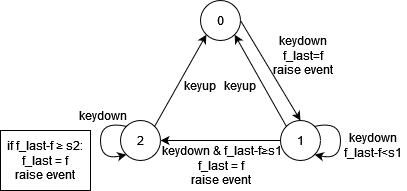

# Magic Jewelry

## 介绍

Magic Jewelry 是一个简单的三消游戏。

这是一个一天写完的技术样品，未在玩法上做过多设计，而是力求保证程序架构坚固，以及实现流畅的动画效果。

## 控制

1. 未选中任何方块时，按方向键移动光标。
2. 先按 X 选中方块，然后按上下左右，就会和对应方向的相邻方块交换。
3. 选中方块后如果不想交换，按 Z 取消选中。

仅支持单人游戏、手柄控制。

## 设计分享

### 以单片机开发的思路看待 WASM4 框架

从本质上 WASM4 实际上是一个单片机嵌入式平台。无论从硬件指标的刻意限制上，还是从直接操作交互内存的 API 风格上，都是典型的单片机开发的特征。

因此直接使用单片机领域成熟的开发方法，对 WASM4 应用各部分的开发过程是非常有利的。

### 组件分拆

通过以下的组件分拆实现单一责任：

 - `@common`: 纯组件，全局工具函数
 - `GamePad`: 纯组件，管理控制器输入
 - `Board`: 纯数据结构，游戏盘面
 - `Game`: 游戏整体组件，负责场景切换
 - `Title`: 一级场景，标题界面
 - `Playing`: 一级场景，游戏界面
 - `Animate`: 二级场景，动效播放

### 时间与随机数

和单片机一样，WASM4 框架只有时间片（tick）的概念，没有时间，也没有随机性。理论上，同一个程序只要输入相同的按键顺序，都会得到相同的游戏结果。（TAS 的原理）

因此在公共模块中，必须每次 `update()` 跟踪当前帧数，以便动效模块和随机数模块使用。

### 不可变数据结构

棋牌、战旗、策略等游戏，以及文书编辑等应用软件，经常复制一份副本进行修改，但在必要时也可以随时撤销的需求。

MoonBit 语言的 core 标准库提供了 `@immut` 不可变数据结构。这些数据结构可以廉价复制，复制仅仅是引用数加 1。并且对副本做部分修改时，基本上只需要在内存中保存修改的元素，剩余元素会自动复用旧的存储空间，节省内存开销。（这和单纯的 CoW 机制不一样）

本游戏中简单使用了 `@immut/array` 不可变数组，实现对盘面状态的保存。因此在游戏代码中，能够见到到处都在传递整张盘面的数据，但内存开销没有爆发性的增长。

这种数据结构十分适合在游戏中实现“悔棋”机制（本游戏中尚未实现）。实际开发“悔棋”功能时，最大的麻烦莫过于撤销修改时必须非常小心，才能保证退回去的上一步盘面是完全正确的。稍微差一点点，盘面就彻底乱套了。

如果使用不可变数据结构，就不存在这个问题。只需要把每一步的盘面保存下来，撤销到哪一步，就把那一步的盘面读入内存即可。这就像是把不稳定的“撤销”做成了坚固的“保存”，但在内存开销上仍然可以接受。

### 控制器输入

WASM4 的控制器输入只能单纯读取按键的按下还是抬起。当然不可以在 `update()` 里看到按下就触发事件（这样会按住多少帧就连续触发多少次），我们希望用最简单的代码实现：

 - 一次按下到抬起，只触发一次按键
 - 按住的时间够长，可以重复触发按键（用于按住方向键快速移动）
 - 重复延迟和重复速度可以调整

这里我们使用了单片机系统中流行的“有限状态机”（FSM）来设计。对每一个按键，设计“0=未按下,1=首次,2=重复”这3个状态，然后按照以下的逻辑迁移：

 - 重复延迟S1 = 20帧, 重复速度S2 = 10帧
 - 当前帧数为`f`, 每个按键记录上次的帧数`f_last`
 - 抬起 = →状态0（无条件）
 - 按下 && 状态0 = →状态1, `f_last=f`, 触发按键事件
 - 按下 && 状态1 && `f - f_last < S1` = →状态1
 - 按下 && 状态1 && `f - f_last ≥ S1` = →状态2, `f_last=f`, 触发按键事件
 - 按下 && 状态2 && `f - f_last < S2` = →状态2
 - 按下 && 状态2 && `f - f_last ≥ S2` = →状态2, `f_last=f`, 触发按键事件

状态机能够完全表达一个按键所有可能的迁移情况，最大限度避免漏掉边角情况导致的bug。在本游戏中 `@gamepad` 包直接提供了这种状态机按键的功能，可以直接在任意 WASM4/MoonBit 工程中独立适用。

如果在真实硬件上，更可以利用更为复杂的状态机，实现同时带有“按键消抖”和“案件重复”功能的按键。详细了解这个思路可以参考《AVR单片机嵌入式系统原理与应用实践（第 3 版）》(马潮 编著, 2021)这本书。

### 场景切换设计

嵌入式设计的一个常见考虑是分离界面状态，千万不要让一个界面展示时，误触发另一个界面的逻辑。

因此本游戏样例中，设计了“标题”和“游戏”两个场景，而在“游戏”中设计了“操作”和“动效展示”两个子场景。每一时刻只有一个场景生效，让 WASM4 引擎只触发一个场景的 `update()` 逻辑。

虽然现在没有实现，但之后按照同等的策略，也可以扩展“菜单”、“结算”等更复杂的场景界面。

MoonBit 是一个标准的 GC + ByRef 传递的语言，因此父子对象之间如果要交互，一般通过持有引用就可以了。但在 MoonBit 中如果两个数据结构跨包（pkg），那么父子对象之间互相引用是很难做的（循环依赖），只能严格进行单项引用。本游戏样本中简单处理了这个情况，设计了一个简易的全局事件总线，承担子对象要求父对象触发事件的功能。

### 动效设计

良好而坚固的动效需要以下这几个考虑：

 - 事先进行准确的编排
 - 事中进行忠实的演出
 - 动效是附加数据，所以动效数据必须与游戏状态数据隔离
 - 动效是额外装饰，所以动效绝对不能影响程序逻辑
 - 功能万一需要降级，可以接受动效播放中途有小bug，但播放完毕之后的游戏逻辑仍然正确

因此作为游戏数据核心的 `Board` 对象，只保存盘面状态，绝对不含任何动效数据。它的核心方法 `Board::swap` 只是执行棋子移动，并将 `Board` 内部数据改成移动后的新状态。这个作为原则是永远不改的。

而我们需要的动效步骤（交换、消除、掉落、再消除…）虽然繁杂，但最终它仅仅是 `Board::swap` 的一个额外的返回值而已。从数据上来讲，极不重要，没有意义。它仅仅是 `Board` 把计算过程中的一些中间结果，整理反馈了回去，理论上是可以丢弃的无用值罢了（假设游戏中不需要任何动效）。

收到动效数据后，将 `Playing` 的子场景切换到 `Animate` 然后让它承担每一帧的绘制就可以了。`Animate` 虽然庞杂，但是只管理绘制过程，实际上相当于一个视频播放器。

## 仓库

本项目的仓库位于 <https://github.com/shamiao/mbt-wasm4-magic-jewelry> 。不求star，只是随手写的，大家随意看看，希望您觉得游戏有一点好玩，或者代码有一点用途。
