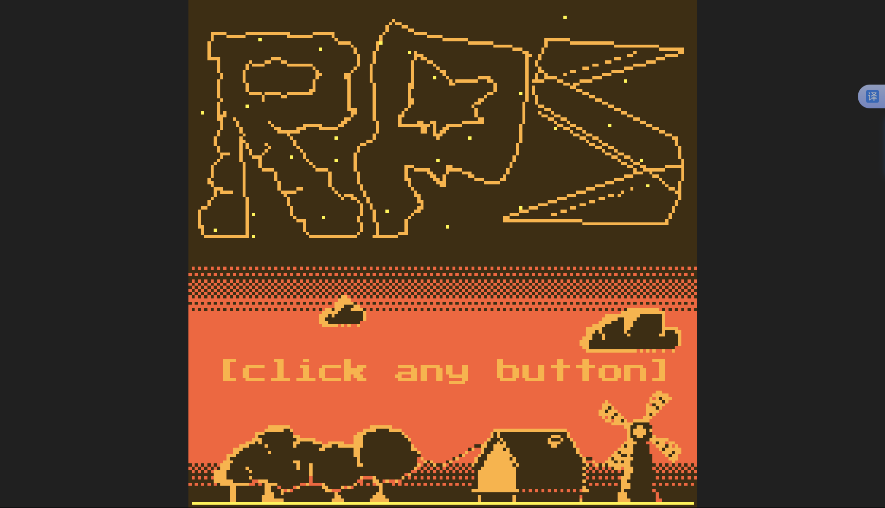
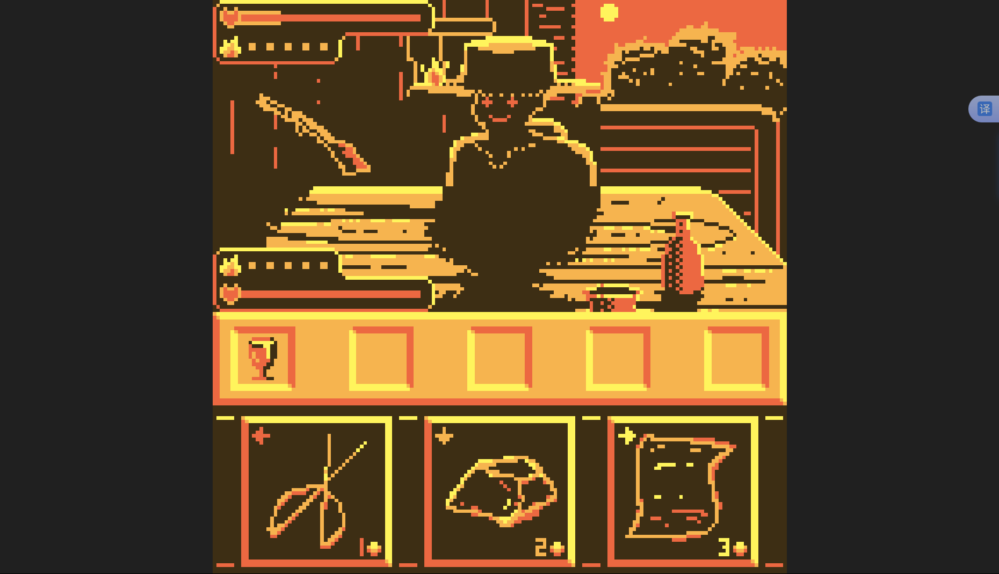

# whoami/sjb!
### 金黄以西
平静的日落时分，陌生的人，你不需要知道他是谁，只需要知道你需要做出什么选择，在日落之前战胜对方......而太阳不会落下。

你要做的非常简单 选择一个选项并祈祷它能克制对面选择的选项：
1枚金币：象征剪刀
2枚金币：象征石头
3枚金币：象征布
如果你玩过石头剪刀布 就知道是如何运用金币比拼了（1＜2＜3＜1）
或者你也可以使用额外的选项或者看透敌人的意图？尽管那可能并不轻松，敌人也不会一直当个傻子。

## 展示

## 按键介绍：
z 返回主菜单
x 确认
← 出剪刀
↓ 出石头
→ 出布
↑ ？

## 属性介绍
心
代表你的承受能力（hp），归0的一方将退出游戏

火焰：buff
当你胜利时 获得1层集中（提升20%暴击率）
当你失败时 获得1层愤怒（造成伤害+2）
**二者不可兼得，上限不可出五。**

暴击率
胜利时概率触发，使敌人受到双倍伤害

胜负
胜方对负方造成10伤害
若平局，双方都会失去5hp

## 掉落物
对面好像爆装备了？
看看这些都是什么：
渗水的红色高脚杯：暴击率+10%
仿造纪念币：敌人造成伤害-2
愤恨之火：你负时额外获得1层愤怒
夕落沙漏：每回合开始时，对敌人造成1点伤害 你每次胜利，其伤害都会增加1
赌徒骰子：暴击伤害+100% 胜利额外获得1层会心

## 心理
你是否有选择某个选项的偏好，无论什么答案，在和敌人对战后，你会发现你会产生一种偏好的

## ?
造成双倍伤害，但当你使用它时，对方也会使用

## 制作人员
程序
 游戏逻辑-purr
 渲染及交互逻辑-lebcat5
美术-See_Gyun，lebcat5
音乐-See_Gyun
策划-lebcat5
