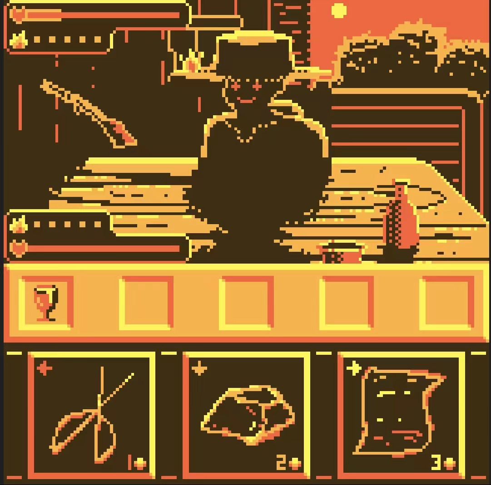

### 金黄以西
平静的日落时分，陌生的人，你不需要知道他是谁，只需要知道你需要做出什么选择，在日落之前战胜对方......而太阳不会落下。

你要做的非常简单 选择一个选项并祈祷它能克制对面选择的选项：

1枚金币：象征剪刀

2枚金币：象征石头

3枚金币：象征布

如果你玩过石头剪刀布 就知道是如何运用金币比拼了（1＜2＜3＜1）

或者你也可以使用额外的选项或者看透敌人的意图？尽管那可能并不轻松，敌人也不会一直当个傻子(所以他也不会完全随机地做出选择)。

## 开始界面
胜利-开始游戏

失败-返回主界面

平局-设置（目前还在制作中【会推出难度调整和历史最高分查看功能哦】）

## 属性介绍
    心
代表你的承受能力（hp），归0的一方将退出游戏

    火焰：buff（敌人也有情绪）

当你胜利时 获得1层集中（提升20%暴击率）【总之伤害提升了】

当你失败时 获得1层愤怒（造成伤害+2，受到伤害-1）【总之伤害稳定地提升了，还有回旋的余地】

**二者不可兼得，上限不可出五。**

    暴击率

胜利时概率触发，使敌人受到双倍伤害

    胜负

胜方对负方造成10伤害

若平局，双方都会失去5hp

## 掉落物
对面好像爆装备了？  看看这些都是什么：

渗水的红色高脚杯：暴击率+20%

仿造纪念币：敌人攻击力-2（造成基础伤害-2）

愤恨之火：你负时额外获得1层愤怒

夕落沙漏：每回合开始时，对敌人造成2点伤害 你每次胜利，其伤害都会增加2

赌徒骰子：暴击伤害+100% 胜利额外获得1层会心

## 分数！
关卡：每个阶段+10%分数

回合数：初始1200分数，每经过1个回合少获取120分数，每经过1阶段该项获取分数上限+240

迅速程度：每回合初始600分数,每经过1s少获取600分数，最终取平均

致命程度：基于你造成的最高伤害获得5倍分数

血量：结束时每1点hp+3分数

打出：打出剪刀+20分数，打出石头+15分数，打出布+10分数

## ?
造成双倍伤害且暴击伤害+100%，但当你使用它时，对方也会使用

## 制作人员
程序

 游戏逻辑-purr

 渲染及交互逻辑-lebcat5

美术-See_Gyun，lebcat5

音乐-See_Gyun

策划-lebcat5

## 展示

# tips（这是攻略来的，不过想拿高分可不能只靠攻略哦）
敌人第一，二阶段的意图很容易发现
第三阶段与你的行动有关
第四，五，六阶段与敌人的行动有关
第五，六阶段都与敌人胜负有关

