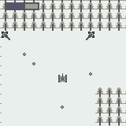
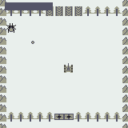
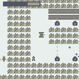
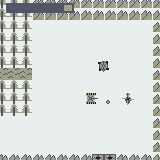
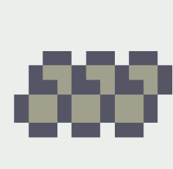

# 坦克儿大冒险 Tankle Adventure 

不用解释了，赶紧向前冲，消灭敌人，拯救世界！

## 四个关卡

### 丛林

欢迎来到坦克儿大冒险。在丛林你可以熟悉各种敌人和地形，在丛林出口击败两座炮塔后即可进入沼泽。

### 山洞

沼泽非常凶险，为了增强自己，先进入山洞搜刮一翻吧。这里有一座蜘蛛坦克看守着重要道具。

### 隧道

如果速度过快，似乎可以反向通过传送带，进入一条神秘的隧道了。这里有很多惊喜和挑战，还有一只长龙列车炮守护着通往神秘地点的大门。

### 沼泽

原来隧道的出口就是沼泽的 Boss 战。当然，如果你有足够勇气，可以跳跃山洞和隧道，直面最终 Boss 海龟战车和雄鹰直升机。

## 道具说明

装甲片：获取后恢复生命值，并且最大生命值+1。整个游戏有5个装甲片，你全部找齐了吗？

氮气：获取后按X键可以冲刺，有短暂的冷却时间。冲刺可以反向通过短的传送带。

轮胎：获取后提升移动速度，可以在传送带上反向行进。

火箭：获取后武器变为火箭弹，威力更大，弹道更快。

