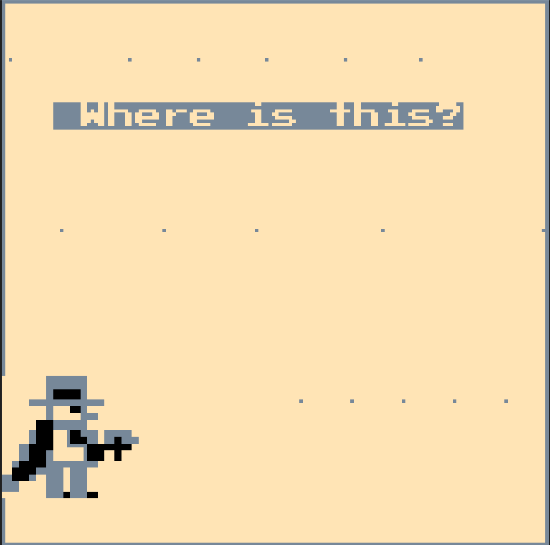
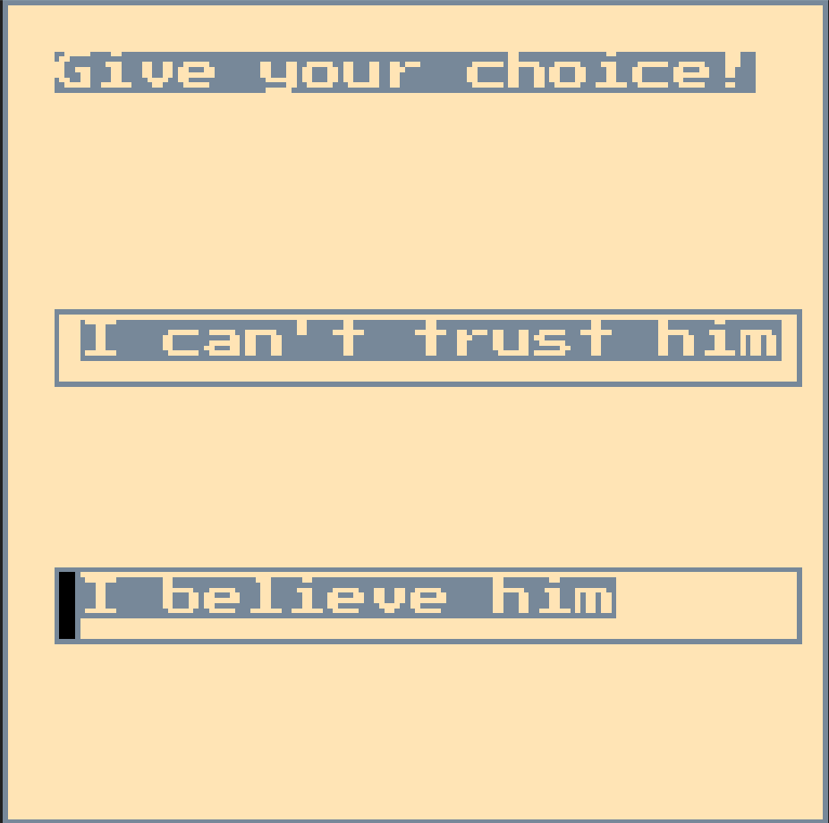
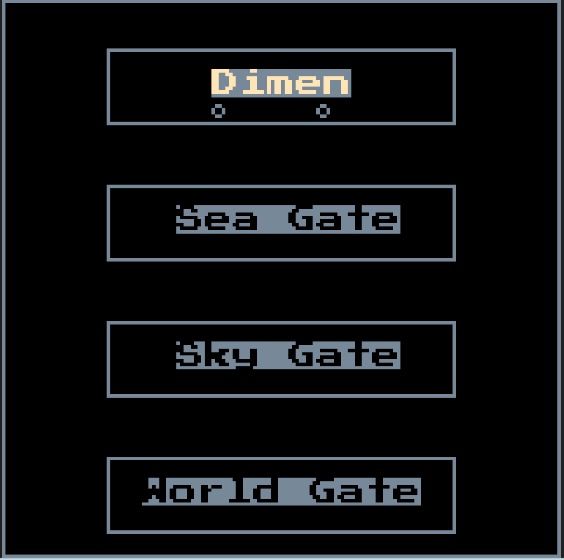
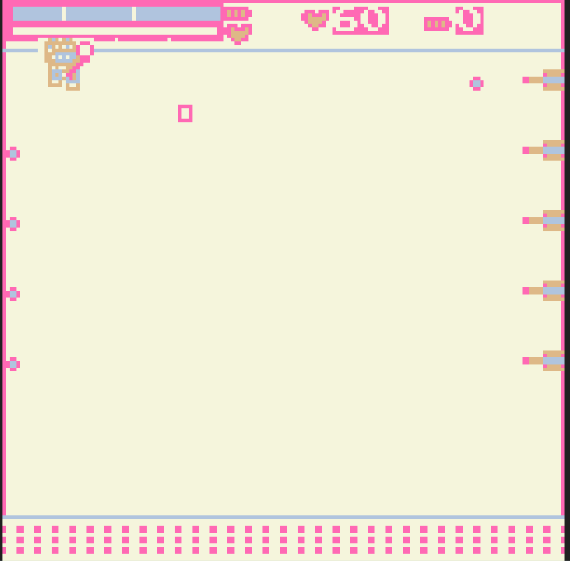
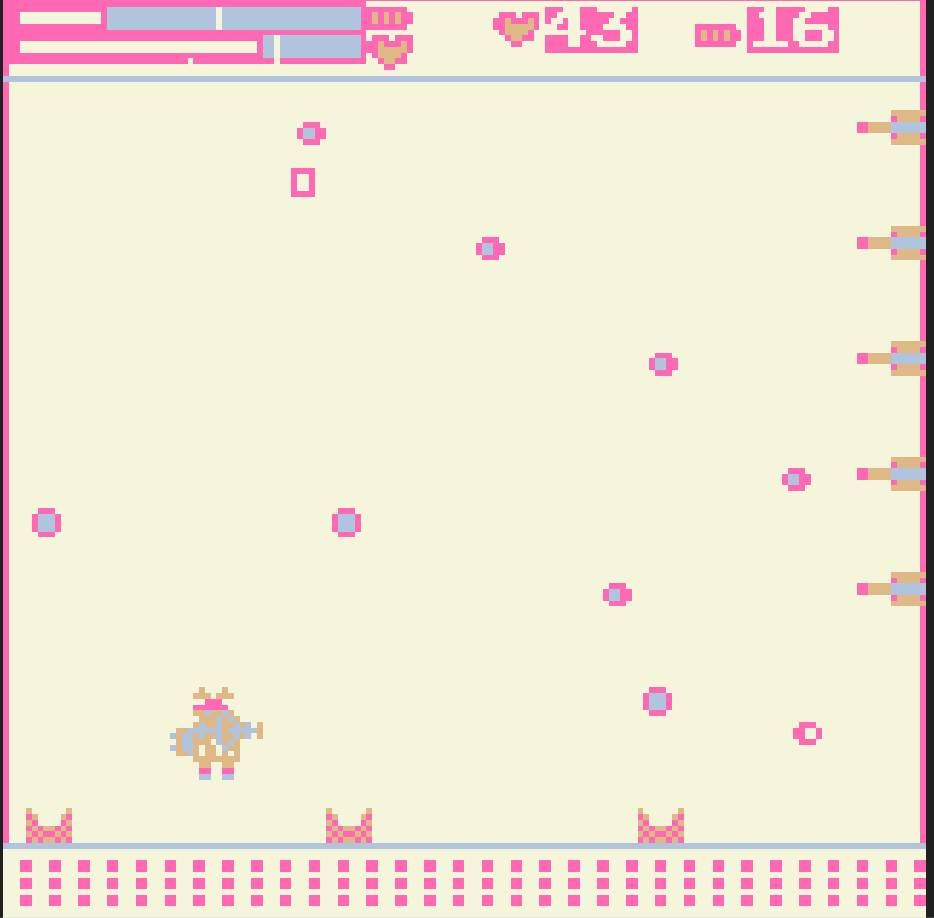
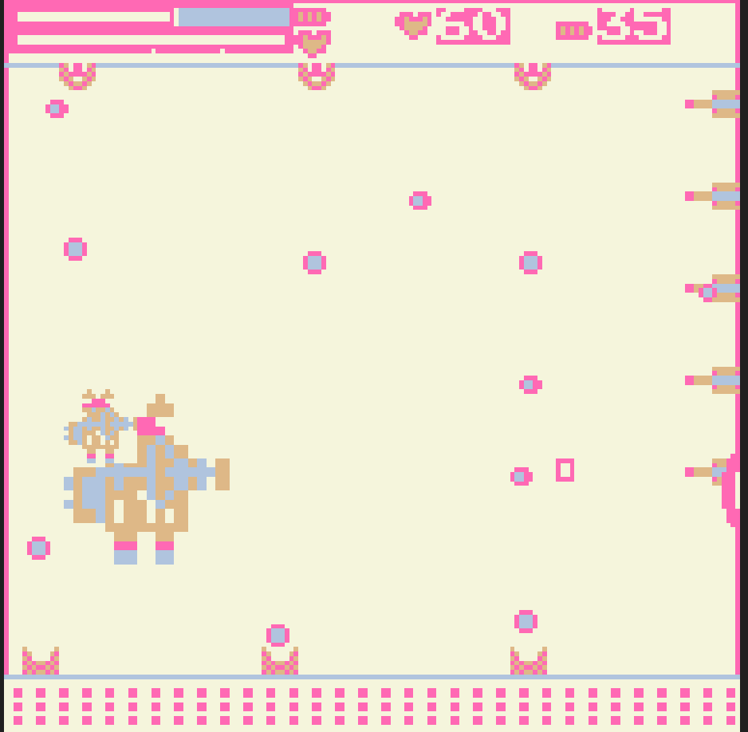
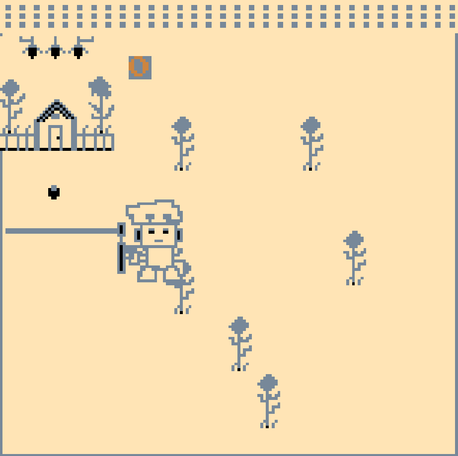
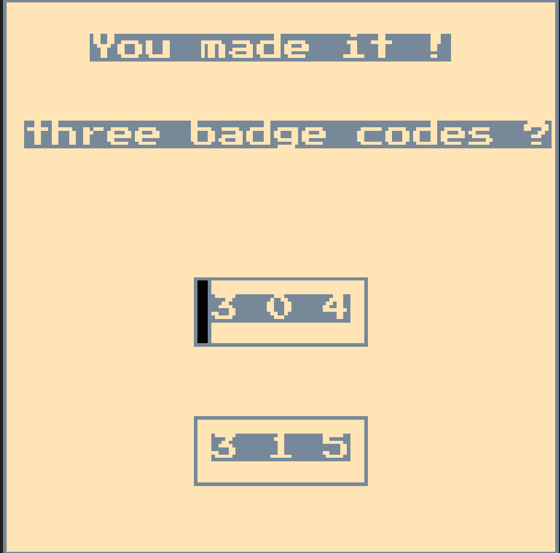
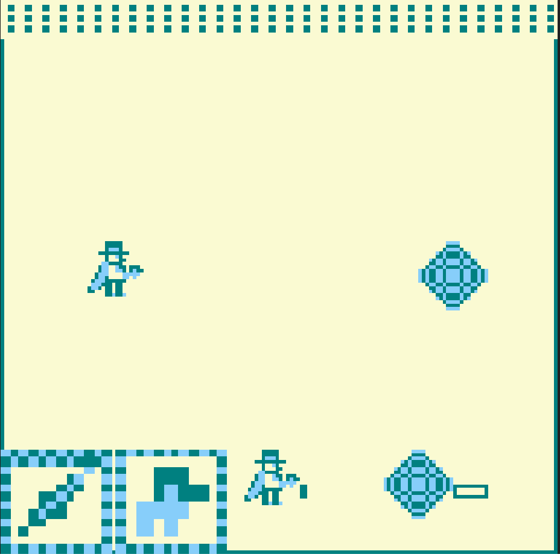

异世界宝石
你是一个顶级的怪盗好手，有一天，你看到了一个很晶莹剔透的宝石，你很想把这个宝石拿过来收藏，于是你凑近观看。
你刚伸手准备摸宝石的时候，外面盒子的引力把你整个人都翻倒了，还把你吸了进去，而醒来以后，这个世界是异世界。
你运气很好，碰到了异世界的守护者，守护者知道了你的意图并愿意帮助你，前提是你要足够相信他，这你要做好决定。
如果你选择相信他，拿到宝石的三个关卡分别有着对应的密码code，如果直接到达最后一层，会有全部的密码code。
寻找密码的道路不同，难度不同，背景也不同，这考验怪盗者也就是你的实力。
如果你能找到密码，那打开最后一个关卡（world gate），选择正确的并进入，里面会有新的东西给你探索。
进入探索期间，如果误认危险区域，那就自救保命吧，不要被宝石所吞没，找到那封信并寻得宝石。
如果你选择到错误的那就只能祝你好运了，但是不要用猜哦，真正的怪盗应该有实力看到最后。

开始界面
按空格开门，，迎来异世界，接着会走场景，,场景是一步一步走的，如果你看过了第二次玩，可以直接按空格键跳过。

,空格键选择你的答案，z键确认你的答案，进入新的场景。如果选择相信，鼠标左键选择关卡难度不同，右键点击进入，,
关卡难度不同，在于血量不同，每个门都有三个场景，逐步变难，根据实力选择，，,，
每个门进入后颜色不同，待玩家自行探索，如果进入后你觉得难度太大，可向左走，左边是使者，会帮你，分数5转化为充能1，
速度会随着充能的增大而增大，所以不要想着简单的靠使者来完成过关，看到密码，当然，使者也是你来控制，，
将使者往右走即回到主游戏场景，在能量条上有分割线，代表不同的升级难度，不同程度死亡会呈现部分密码，最后会有完整密码。
在关卡中，有三个角色，兔星：攻击向上，鹿星：攻击向右，魅星：攻击向下，对应不同攻击，玩家可以实时切换来抵挡攻击和抵消子弹，按空格键切换角色，重要的一点是，
鹿星不被允许进入使者世界，否则将失去攻击，因为鹿星在不同难度下达到某个程度会变大免疫攻击，同时将玩家血量回复最大，玩家每次吃一个方形硬币会使能量条增一，
硬币位置会更新，能量条打满以后就可以看到全部密码。

如果你得到密码可以选择第四个关卡，选择密码，也是空格键选择密码，z键确认你给的密码，，进入以后，可以自行探索，找到那封信寻得宝石即是胜利。
如果乱猜误认陷阱，宝石会过来吞噬你，那就自求多福，空格键是剑，z键是子弹。如果你活了下来，会直接到新家（dao men home），当然那个门进去了
再也不会有事了，因为会直接回来；如果你选择正确密码但还是误入门的话，那就是你运气不好，同样的操作方法自救吧。