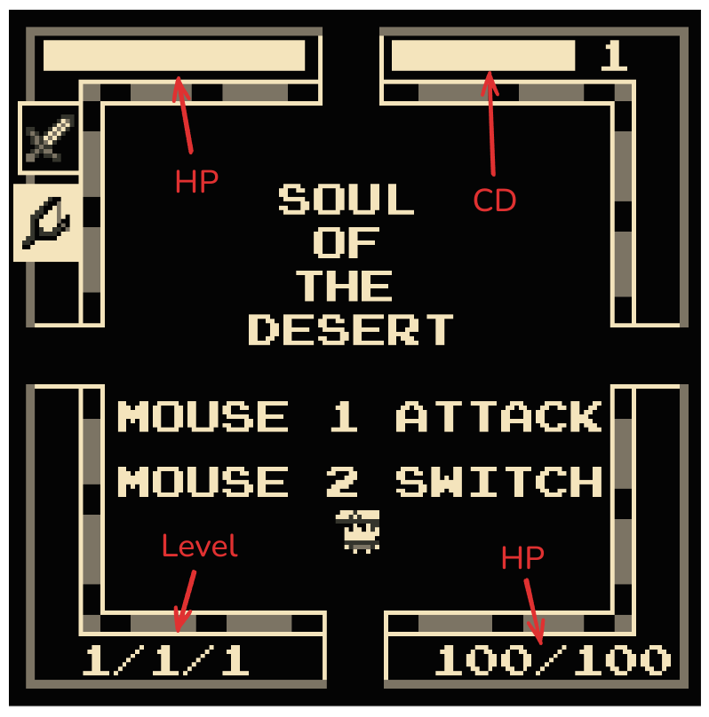
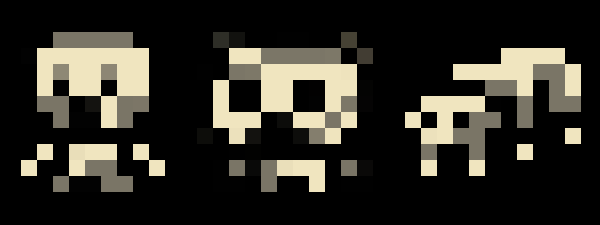
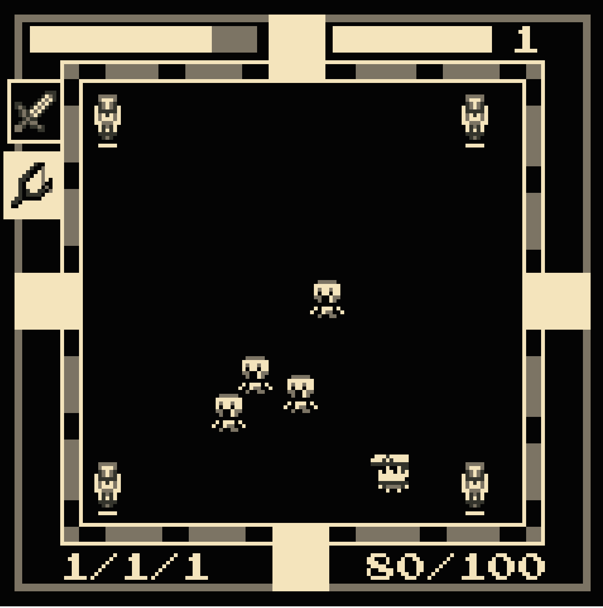
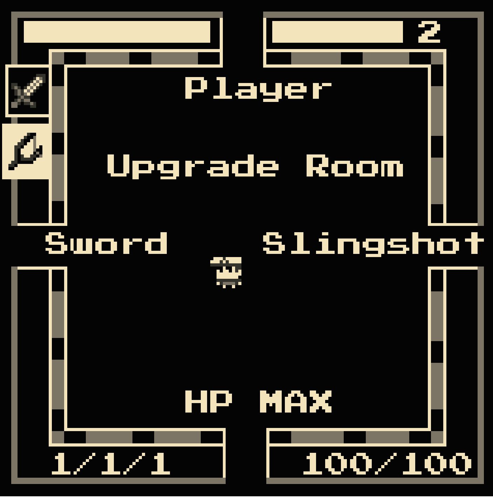
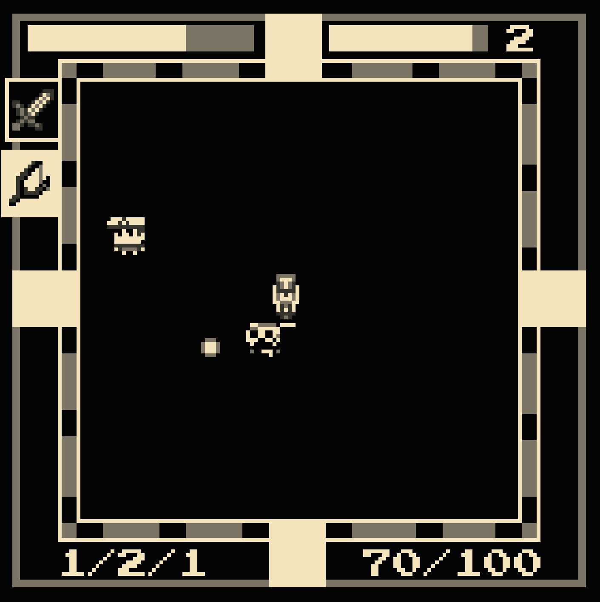
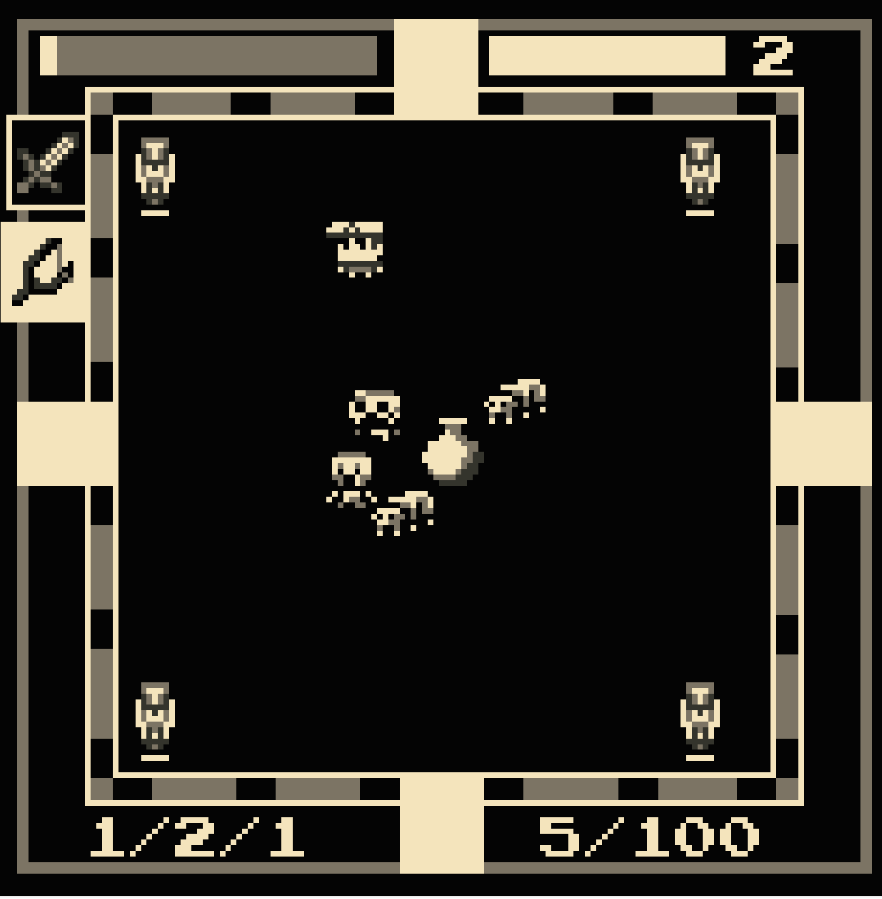

# Soul of the Desert / 沙漠之魂

沙漠之魂是一款类似以撒的结合、元气骑士的 Rogue-like 游戏，玩家通过在各种各样的房间用进战或远程武器打败怪物，进而升级自己的装备和角色，但是注意，在冒险的过程中怪物的数量和等级也会随之增强。

## 游戏玩法与操作

在游戏的主界面，玩家将会看到很多数字，不要疑惑，让我们分别来解释他们：

### 显示

- 左上角与右下角均为玩家的血量显示，一个通过条状显示，另外一个通过数字显示。

- 右上角为玩家的攻击 CD，当该条满时玩家才可以进行下一次攻击，而条的右边为玩家当前手上所持有的武器（1为剑，2为弹弓）。

- 左下角为当前玩家与武器的等级，显示格式为 玩家等级/剑等级/弹弓等级。

### 操作/武器

玩家有两个武器可以选择，游戏开始时默认为剑，可以通过中键切换武器。玩家通过上下左右键移动，并使用鼠标左键攻击。

- 当以剑攻击时，玩家的鼠标点击方向即为需要攻击的方向（有方向即可，不需要点击到对应敌人），系统判定为对角线划分为四块的上下左右判定原则。
- 当以弹弓攻击时，玩家将会向鼠标所点击的方向射击。

武器具有升级机制，剑升级之后范围与伤害都会提升，而对于弹弓，升级还可以提升它的射速。（详细请见下方数据一节）

### 怪物

怪物有木乃伊、骷髅、虫子三种，下面作简单介绍（详细请见下方数据一节）：

- 木乃伊：移速正常，血量较高，伤害正常，近战攻击
- 骷髅：移速较慢，血量正常，伤害较低，远程攻击
- 虫子：移速较快，血量较低，伤害较低，近战攻击

### 机制

你需要通过房间四角的入口进入房间开始冒险，在关卡当中你会遇到各种各样的敌怪，你需要击败他们才能进入下一个关卡，而且怪物的数量和强度会随着关卡数的增加而变强。不要着急，每过三关你也会得到一个升级房间，走入对应的方向就可以升级自己对应的属性，走入两边可以升级武器，上方可以升级玩家自己（血量上限将会提升），下方可以把当前血量回满。

房间当中的障碍物将会随机生成，利用好它们！

    
    
    
    

### 数据

变量为 game_level(游戏等级，即第几个房间), player_level(玩家等级), sword_level(剑等级), slingshot_level(弹弓等级)。

#### 游戏

- 怪物数量：3 + game_level / 2 + game_level / 10 + game_level / 20 + game_level / 40

#### 玩家

- 血量：100 + player_level * 50
- 移动速度：1 block/tick

#### 武器

##### 剑

- 伤害：10 + sword_level * 5
- 范围：4 + sword_level / 4
- 攻击 CD：100 total, 10 + sword_level / 5 per tick

##### 弹弓

- 伤害：8 + slingshot_level * 2
- 子弹速度：0.5 + 0.1 * slingshot_level
- 攻击 CD：100 total, 2 + slingshot_level / 3 * 2 per tick

### 怪物

#### 木乃伊

- 血量：50 + game_level * 10
- 移动速度：0.35 block/tick
- 伤害：10 + game_level * 3
- 攻击范围：约为与玩家接触的 2 格之内
- 攻击 CD：100 total, 3 + game_level / 10

#### 骷髅

- 血量：40 + game_level * 10
- 移动速度：0.3 + 0.05 * game_level block/tick
- 伤害：10 + game_level * 3
- 攻击范围：距离玩家 40 格之内
- 攻击 CD：100 total, game_level per tick
- 子弹速度：等同移动速度

#### 虫子

- 血量：20 + game_level * 5
- 移动速度：0.4 + 0.05 block/tick
- 伤害：5 + game_level
- 攻击范围：约为与玩家接触的 2 格之内
- 攻击 CD：100 total, 2 + game_level / 10