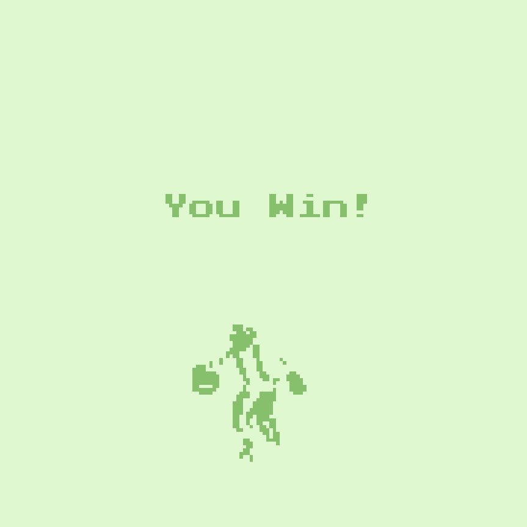

# KunKun 接鸡蛋

## 简介

“KunKun 接鸡蛋”这个游戏的目标是通过控制角色“KunKun”接住掉落的鸡蛋，以获得高分。游戏采用了简单的像素风格，类似于经典的小游戏。 

## 游戏规则

- 角色控制：玩家使用键盘方向键控制 KunKun 移动。
- 接住鸡蛋：屏幕上会随机出现鸡蛋，KunKun 需要在鸡蛋消失或掉落之前接住它们。接住一个鸡蛋后，分数会增加。
- 避免碰撞：游戏可能会增加难度，出现一些障碍物，玩家需要避开这些障碍物，否则会失分或游戏结束。
- 计分和时间：游戏左上角显示得分（Score）和帧数（Frame）。分数表示玩家已成功接住的鸡蛋数目，帧数可能代表游戏运行的总帧数或倒计时。

  
## 图鉴

#### KunKun

  
KunKun 的设计风格简洁、可爱，可能是一个专门用来接鸡蛋的角色。这个形象容易让人联想到经典的像素游戏角色，简洁的设计有助于在小屏幕上清晰呈现角色的动作与状态。

#### 鸡蛋
  
鸡蛋可能是游戏的主要目标物，玩家需要帮助 KunKun 接住尽可能多的鸡蛋来获得高分。鸡蛋的设计也可能非常简约，是一个小的椭圆形，以便在屏幕上清晰可见。

## TODO

- [ ] 添加 GPT AI
- [ ] 添加障碍物
- [ ] 添加 KunKun 技能(shift加速)
- [ ] 添加 KunKun 升级
- [ ] 添加 KunKun 皮肤
- [ ] 添加关卡体验(难度-角色体积)