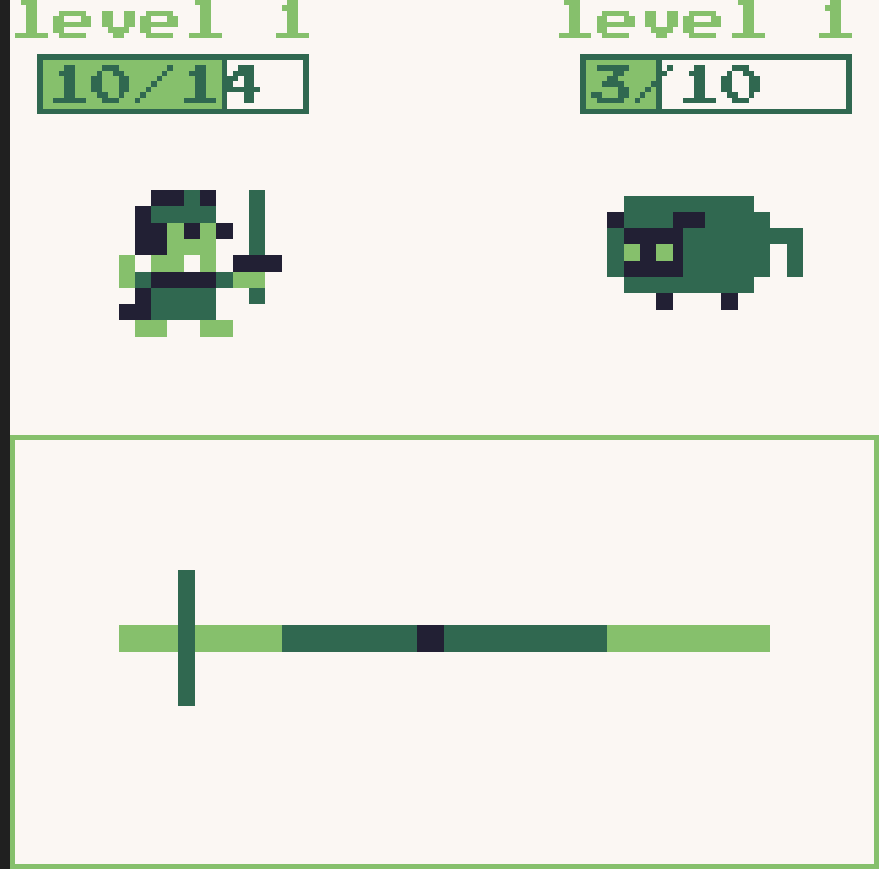
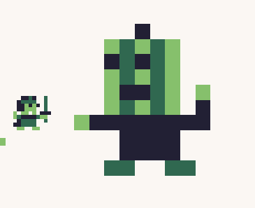

## 地上城与108个魔王

是一款RPG(未完成版)   
你需要扮演一个勇士,一路破关斩将,到最终的魔王前打败它逃离这个电子游戏....  

## 操作说明

按x进入游戏后会是大地图,你是左侧的小人,面前一共有4条道路可供选择(可一直往下走)  

  
可以通过上下左右键来移动,当移动到敌人身上时,会进入战斗界面    
也可以走第四行一路避战  

地图具有随机性,每次重开的前三行都有概率链接,每次打败敌人后下次遇到的敌人等级和伤害均会提升  
示意如下  

  

你也可以通过走位避开当前的战斗,代价是低等级进入后面的战斗,每次战斗的血量都会保留  

或者可以通过拾取地图上的礼物盒恢复血量,不过也会清除该列的敌人  

  

目前只有与咩咩的战斗(AI见敌人图鉴)  

  
进入战斗后最上方为当前经验值与当前等级     
经验满后会升级,升级后属性会提升,血量也会回复满,可以通过击败敌人或一些挑战获得经验   
下方为双方血量   
  
在游戏下方会有菜单,可以通过左右键来选取一个选项(选中的会浮高)  

  
按下x键后执行对应的选项,同时结束自己的回合   
目前只有三种选项  
- Fight: 攻击敌人,目前是`level*10`点力量  
- Heal: 治疗自己,目前是恒定恢复10点血量,且不会超过最大血量
- Defense: 防御,下回合被攻击时伤害恒定为1 

 
当选择攻击时,底下会出现攻击区,需要按x来停下竖条,并根据竖条停在的区域来增加伤害
- 中心 : 5*level
- 中心两旁: 3*level
- 两侧: 1*level

当任意一方选择防御时,血条旁边会有一个小盾牌的标识   

  

当敌人进行攻击时,菜单栏会变成小游戏的形式(设计参考了UnderTale)  
例如下面的小游戏就需要你躲避开柱子,否则敌人将进行攻击,若判定成功则敌人此次攻击失败  
更多样例参考小游戏一栏  

  

当敌人血量归零后,回合将会胜利    
反之当自己血量归零时,游戏结束   
  
## 敌人图鉴

### 普通

#### 咩咩

  
很可爱的咩咩,但因为你在冲撞路线上了,所以它很生气

血量: 5*level  
攻击: 
- 咩咩冲击: 3*level点伤害,5%概率暴击,3级后概率翻倍   

防御: 每2次攻击后进行防御    
治疗: 无

  
罪魁祸首南瓜王,需要你打败它来拯救世界

血量: 108  
攻击: 根据玩家的等级动态伤害 
防御: 无   
治疗: 第一次降至56血后恢复至100血
特殊: 
- 当玩家等级不是19级时,南瓜王累积攻击13次会直接失败
- 玩家攻击南瓜王固定为10,当等级够高时伤害为增加
- 当玩家等级为19时,每次只能造成3点伤害,且小游戏速度加快,南瓜王固定造成大量伤害  

## 小游戏

目前有两种

### 避开柱子

  
柱子会从左右两侧往反方向运动,你只需要通过操纵小人避开就好(参考骨头)  
每次的数量都是随机的

### 挡球

  
球会从两侧出现,你需要通过左右键来接住所有的球  
球的数量都是随机的

## 彩蛋?

在战斗界面使用Konami代码可以直接满级`up up down down left right left right z x`
但也会加大之后的战斗难度  
  
## 其他

本游戏由[FrenchPicnic](https://github.com/FrenchPicnic)一人开发

代码仓库: https://github.com/FrenchPicnic/MoonbitWasm4

博客: https://frenchpicnic.github.io/posts/201cd6df/

视频链接: https://www.bilibili.com/video/BV19PU3YSExp/

## 鸣谢

游戏灵感来源: [UnderTale](https://undertale.com/)

游戏素材来源:  
以下素材来源均可直接商用  

[人物形象](https://dotown.maeda-design-room.net/)

[攻击动画](https://pixlab24.com/character/27243/)

首页城堡使用了AI初次绘制,手动二次加工