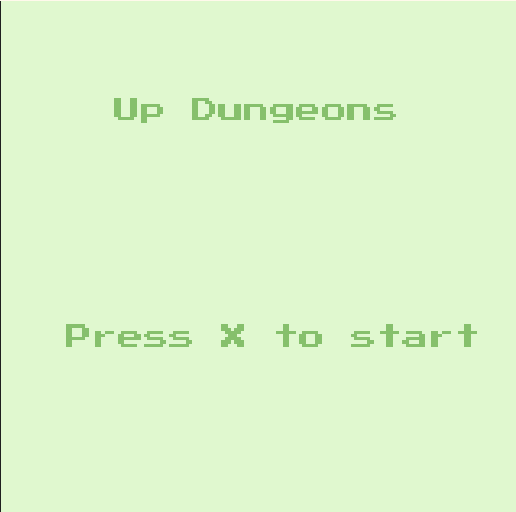
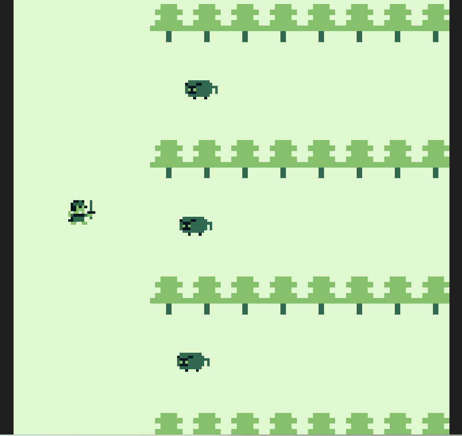
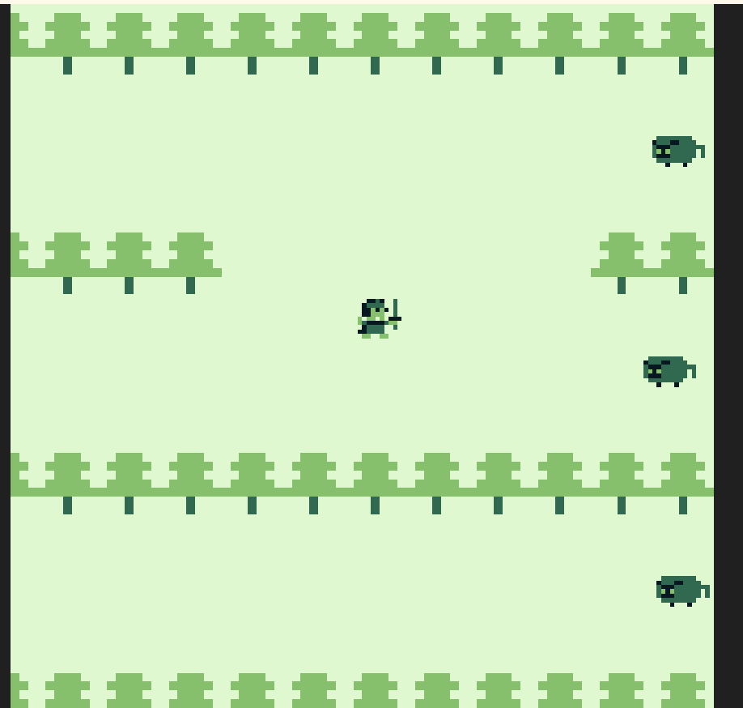
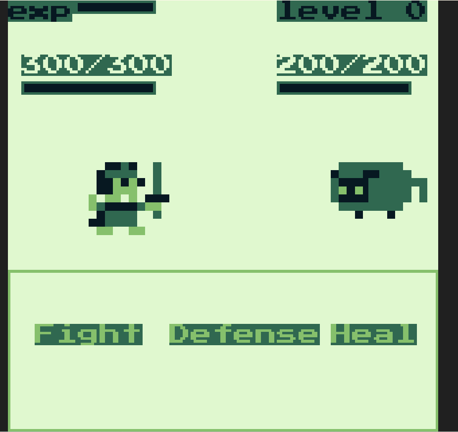
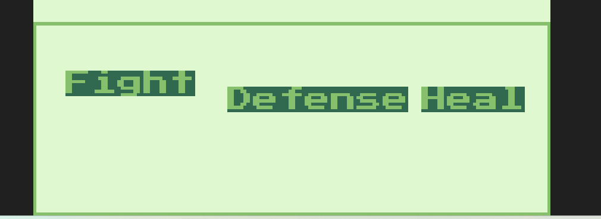
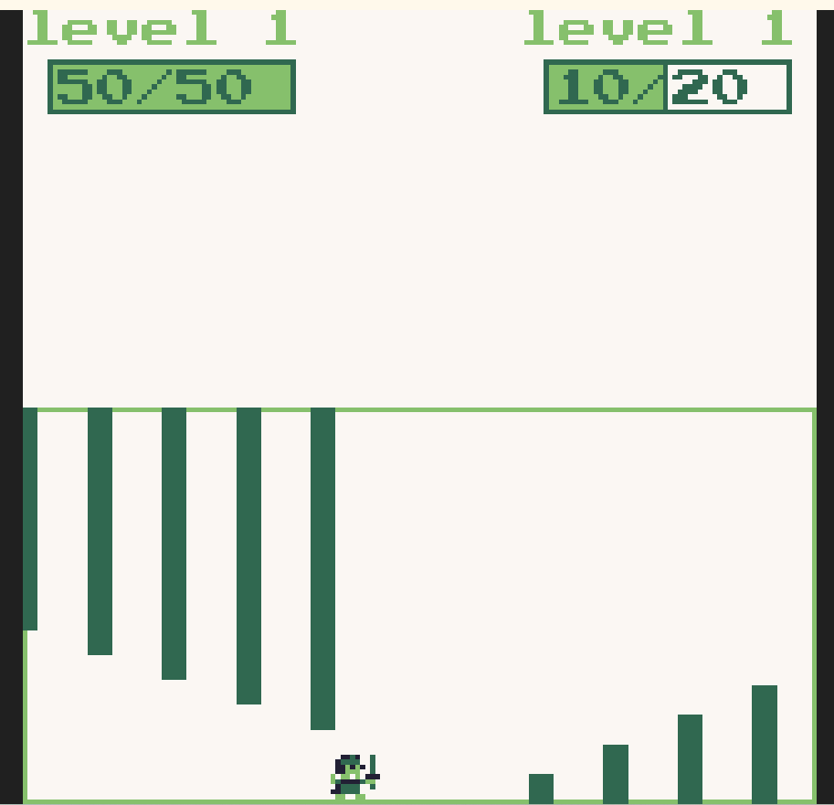

## 地上城与108个魔王

是一款RPG(未完成版)   
你需要扮演一个勇士,一路破关斩将,到最终的魔王前打败它逃离这个电子游戏....  

## 操作说明

按x进入游戏后会是大地图,你是左侧的小人,面前一共有4条道路可供选择(可一直往下走)  

  
可以通过上下左右键来移动,当移动到敌人身上时,会进入战斗界面    
也可以走第四行一路避战  

地图具有随机性,每次重开的前三行都有概率链接,每次打败敌人后下次遇到的敌人等级和伤害均会提升  
示意如下  

  

你也可以通过走位避开当前的战斗,代价是低等级进入后面的战斗,每次战斗的血量都会保留  

目前只有与咩咩的战斗(AI见敌人图鉴)  

  
进入战斗后最上方为当前经验值与当前等级     
经验满后会升级,升级后属性会提升,血量也会回复满,可以通过击败敌人或一些挑战获得经验   
下方为双方血量   
  
在游戏下方会有菜单,可以通过左右键来选取一个选项(选中的会浮高)  

  
按下x键后执行对应的选项,同时结束自己的回合   
目前只有三种选项  
- Fight: 攻击敌人,目前是`level*10`点力量  
- Heal: 治疗自己,目前是恒定恢复10点血量,且不会超过最大血量
- Defense: 防御,下回合被攻击时伤害恒定为1 
当任意一方选择防御时,血条旁边会有一个小盾牌的标识   

  

当敌人进行攻击时,菜单栏会变成小游戏的形式(设计参考了UnderTale)  
例如下面的小游戏就需要你躲避开柱子,否则敌人将进行攻击,若判定成功则敌人此次攻击失败  
更多样例参考小游戏一栏  

  

当敌人血量归零后,回合将会胜利    
反之当自己血量归零时,游戏结束   
  
## 敌人图鉴

### 普通

#### 咩咩

  
很可爱的咩咩,但因为你在冲撞路线上了,所以它很生气

血量: 10*level  
攻击: 
- 咩咩冲击: 3*level点伤害,5%概率暴击,3级后概率翻倍   

防御: 每2次攻击后进行防御    
治疗: 无

## 墓前进度

基本的战斗逻辑与UI

## 彩蛋?

在战斗界面使用Konami代码可以直接满级`up up down down left right left right z x`

## TODO

- [x] 添加敌人
- [ ] 添加更多敌人AI
- [ ] 不同的敌人属性
- [ ] 不同的敌人技能
- [x] 添加人物升级与属性提升
- [x] 添加大世界
- [x] 美化游戏画面(菜单栏/人物模型/血条等)
- [x] 加入一些神秘的小游戏,充当肉鸽中的惊喜选项
