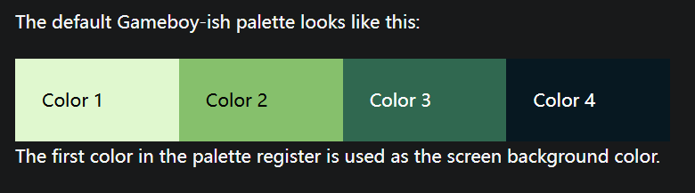

# 地上城与108个魔王/Up Dungeon 

是一款肉鸽+RPG的游戏(未完成版)   
你需要扮演一个勇士,一路破关斩将,到最终的魔王前打败它逃离这个电子游戏....  

## 项目说明

美术: 我  
程序: 我  
音乐: 我  

因为默认四原色就满足我的需求了,所以没有其他颜色   

## 操作说明

在游戏下方会有菜单,可以通过左右键来选取一个选项(选中的会浮高)  
按下x键后执行对应的选项,同时结束自己的回合  
目前有三种选项  
- Fight: 攻击敌人
- Heal: 治疗自己
- Defense: 防御,让敌人攻击的伤害为1

当敌人血量归零后,游戏将会胜利  
反之当自己血量归零时,游戏结束  
  
## 敌人说明

参考[敌人图鉴](./doc/Enemy.md)

## 博客地址

https://frenchpicnic.github.io/posts/201cd6df/